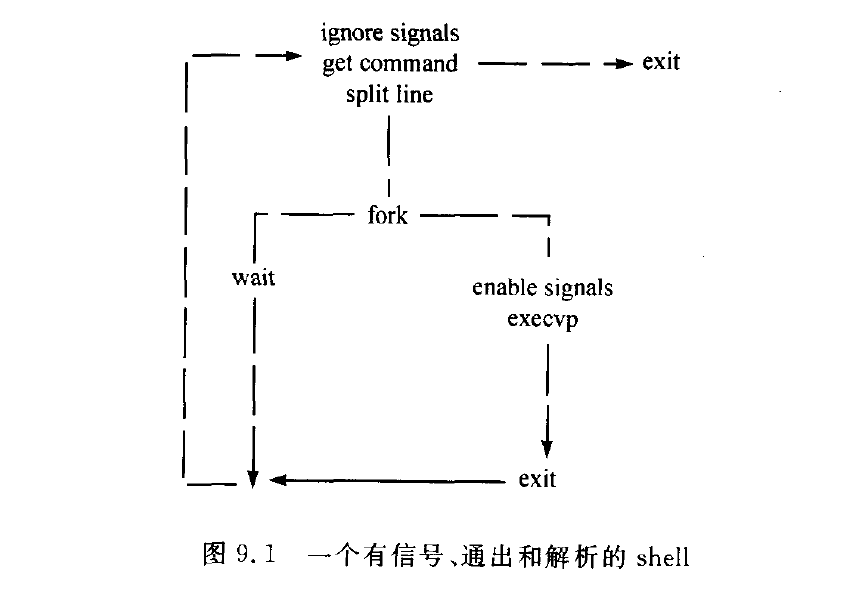

# 第9章 可编程的shell、shell变量和环境：编写自己的shell

## sh的编程特征

1. 变量
2. I/0(用户输入)
3. if...then（控制）
4. environment（环境变量）

## smsh1.c - version 1

1. next_cmd:从输入流读入下一个命令。调用malloc来分配内存以接受任意长度的命令

2. splitline:将一个字符串分解为字符串数组。

3. execute：执行命令

   

解决问题：1.一行命令执行
2.Ctrl+d的正常退出

## smsh2.c - version 2   

### shell中if语句

if语句做条件检测。在shell中，exit(0)表示成功，所有的Unix语句都以exit(0)表示成功。

if语句的条件当有一系列的命令时，**最后一个命令的exit被用来作这个语句块的条件值**

**关键字fi标识if块的结束**

### 增加if后的逻辑

### 改动地方

1. 修改主程序，将execute执行前交给process.c判断是否可以执行
2. process.c。判断程序是否进入if段和执行非if段的语句
3. controlflow.c是shell中if语句此时的状态判断和反馈接下来的行为，为处理if段
4. process.c类似与control.c的启动判断

### 思考

1. 如何处理if中多条指令判断，最后一条为判断条件
2. 此程序是否支持if嵌套

## smsh3.c

